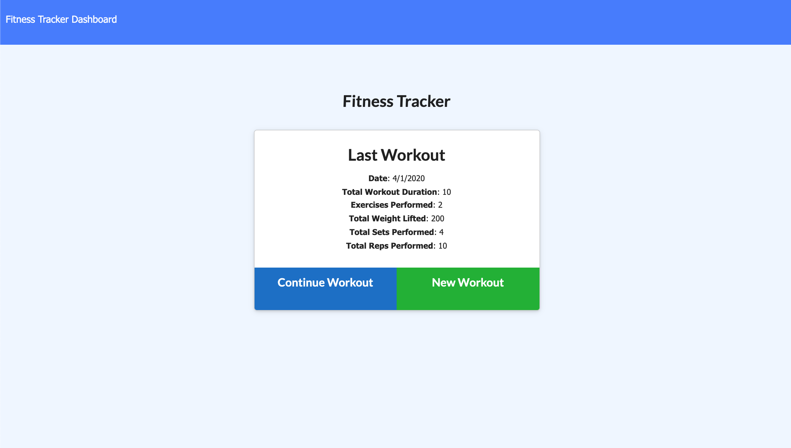
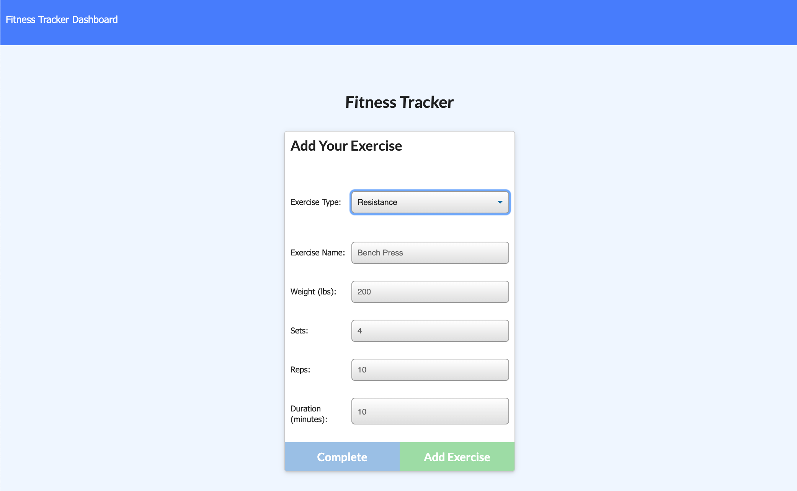
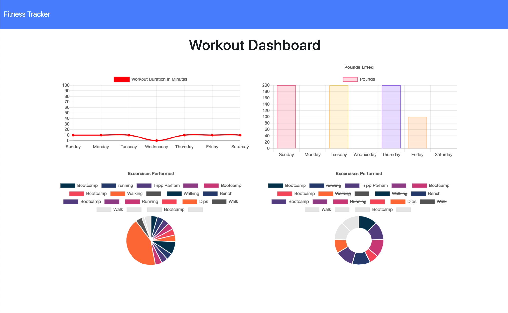

# Workout Tracker

## READ ME
*   Version: 1.0.0
*   Web Design By Tripp Parham
*   Published: Wednesday April 1st 2020

# Description
As an exercise enthusiast, keeping track of daily workouts is very important.  With the Workout Tracker, users can create and easily track their daily workouts.  Workout statistics are displayed in graphical format to easily track gains or loses. Workout Tracker utilizes Node, NoSQL/MongoDB, HTML, CSS, and Javascript.

# Screenshots

## Configuration instructions
* Workout Tracker works on most main stream browsers using the link above.
* No configuration necessory
* Visit the following link to experience the Workout Tracker:
https://fitmarks.herokuapp.com 

**_Operating instructions_**

-   From the homepage, users can create a new workout, or continue and existing workout.
-   Users can select between cardio and resistance training.
-   For cardio, users can enter distance and duration time for each exercise.
-   For resistance, users can enter the weight, number of sets, number of reps and duration in minutes for each exercise.
-   By clicking the Dashboard tab, users can see their weekly workout stats.

**_List of files included in the following structure_**

-   FORME.md
-   LICENSE
-   models
    -   index.js
    -   workout.js
-   package-lock.json
-   package.json
-   public
    -   api.js
    -   exercise.html
    -   exercise.js
    -   index.html
    -   stats.html
    -   stats.js
    -   style.css
    -   workout-style.css
    -   workout.js
-   README
-   routes
    -   apiROutes
    -   htmlRoutes
-   seeders
    -   seeds.js
-   server.js

**_Copyright and licensing information_**

None

**_Contact information for the distributor or programmer_**

Site Developer: Tripp Parham Email: tripp.parham@me.com

**_Known bugs[0]_**

None

**_Troubleshooting[6]_**

-   From the homepage, users can create a new workout, or continue and existing workout correctly.
-   Users can select between cardio and resistance training correctly
-   For cardio, users can enter distance and duration time for each exercise correctly
-   For resistance, users can enter the weight, number of sets, number of reps and duration in minutes for each exercise correctly
-   Clicking the Dashboard tab, users can see their weekly workout stats correctly.

**_Credits and acknowledgments_**

Special thanks to the Instructors and TA's at the UNC Coding Bootcamp. They are an awesome team.:-) Also, I couldn't have completed my tutor, Karen Largent.

Thanks to my Mom in heaven that paid for my Coding Bootcamp.

**_Change Log_**

**_Site Updates_**

-   Version 1.0.0 Released Tuesday April 1st, 2020
